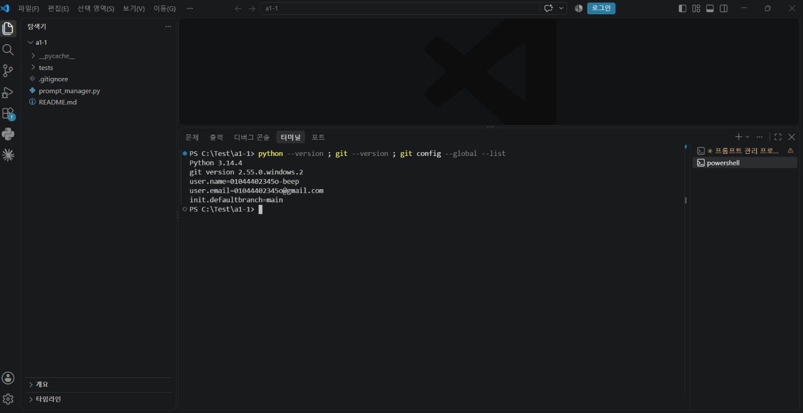
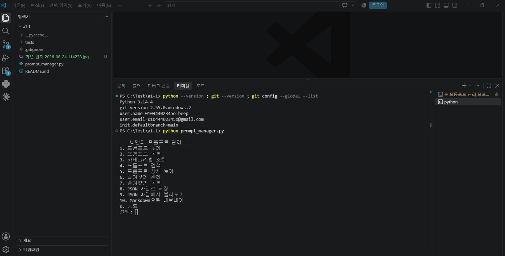
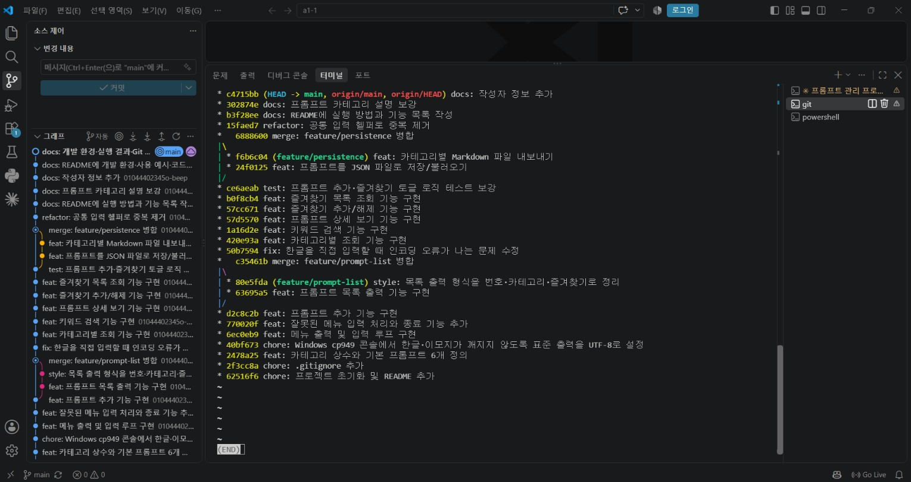
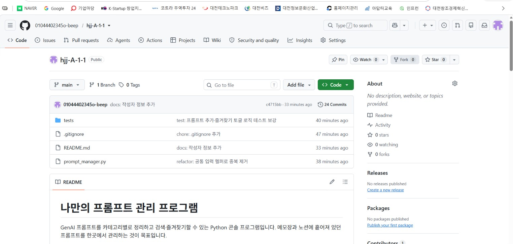

# 나만의 프롬프트 관리 프로그램

GenAI 프롬프트를 카테고리별로 정리하고, 키워드로 검색하고, 자주 쓰는 것은 즐겨찾기로
관리하는 Python 콘솔 프로그램입니다.

메모장·노션·메신저에 흩어져 있던 프롬프트를 한곳에 모으는 것이 목표입니다. 외부
라이브러리 없이 파이썬 기본 문법(리스트, 딕셔너리, 조건문, 반복문, 함수, 파일 입출력)
만으로 만들었습니다.

- **저장소**: https://github.com/01044402345o-beep/hjj-A-1-1
- **작성자**: 01044402345o-beep

## 목차

- [개발 환경](#개발-환경)
- [실행 방법](#실행-방법)
- [기능 목록](#기능-목록)
- [기능별 사용 예시](#기능별-사용-예시)
- [프롬프트 카테고리](#프롬프트-카테고리)
- [기본 등록 프롬프트](#기본-등록-프롬프트)
- [데이터 구조](#데이터-구조)
- [동명 프롬프트 처리 정책](#동명-프롬프트-처리-정책)
- [카테고리 충돌 규칙](#카테고리-충돌-규칙)
- [프로젝트 구조](#프로젝트-구조)
- [코드 구조](#코드-구조)
- [테스트](#테스트)
- [실행 화면](#실행-화면)
- [Git 작업 기록](#git-작업-기록)
- [사용한 Git 명령 정리](#사용한-git-명령-정리)
- [git clone 실행 결과](#git-clone-실행-결과)
- [개발 중 해결한 문제](#개발-중-해결한-문제)

## 개발 환경

| 항목 | 버전 / 설정 |
|---|---|
| Python | 3.14.4 (3.10 이상 필요) |
| Git | 2.55.0 |
| 편집기 | Visual Studio Code |
| VSCode 확장 | Python (`ms-python.python`), Korean Language Pack (`ms-ceintl.vscode-language-pack-ko`) |
| 기본 브랜치 | `main` |
| 외부 라이브러리 | 없음 (표준 라이브러리 `json`, `os`, `sys`, `unittest`만 사용) |

환경 확인 명령:

```bash
python --version          # Python 3.14.4
git --version             # git version 2.55.0.windows.2
git config --global --list
```

## 실행 방법

Python 3.10 이상만 있으면 됩니다. 별도 설치 과정이 없습니다.

```bash
git clone https://github.com/01044402345o-beep/hjj-A-1-1.git
cd hjj-A-1-1
python prompt_manager.py
```

이미 내려받은 폴더에서 실행할 때는 마지막 줄만 입력하면 됩니다.

실행하면 메뉴가 뜨고, 번호를 입력해 기능을 고릅니다. 기능을 마치면 다시 메뉴로
돌아오며, `0`을 입력할 때까지 계속됩니다.

```
=== 나만의 프롬프트 관리 ===
1. 프롬프트 추가
2. 프롬프트 목록
3. 카테고리별 조회
4. 프롬프트 검색
5. 프롬프트 상세 보기
6. 즐겨찾기 관리
7. 즐겨찾기 목록
8. JSON 파일로 저장
9. JSON 파일에서 불러오기
10. Markdown으로 내보내기
0. 종료
선택:
```

목록에 없는 번호나 글자를 넣으면 `올바른 번호를 입력해주세요.`를 출력하고 메뉴를
다시 보여줍니다.

## 기능 목록

| 번호 | 기능 | 설명 |
|---|---|---|
| 1 | 프롬프트 추가 | 제목·내용·카테고리를 입력해 새 프롬프트를 등록합니다. 즐겨찾기 기본값은 해제 상태입니다. |
| 2 | 프롬프트 목록 | 전체 프롬프트를 번호·카테고리·제목·즐겨찾기(⭐)와 함께 출력합니다. |
| 3 | 카테고리별 조회 | 카테고리를 골라 해당 프롬프트만 봅니다. |
| 4 | 프롬프트 검색 | 제목 또는 내용에 키워드가 들어간 프롬프트를 찾습니다. 대소문자를 구분하지 않습니다. |
| 5 | 프롬프트 상세 보기 | 번호를 입력해 내용 전문을 확인합니다. |
| 6 | 즐겨찾기 관리 | 번호를 입력해 즐겨찾기를 추가하거나 해제합니다(토글). |
| 7 | 즐겨찾기 목록 | 즐겨찾기된 프롬프트만 모아 봅니다. |
| 8 | JSON 파일로 저장 | 현재 목록을 `data/prompts.json`에 저장합니다. (보너스) |
| 9 | JSON 파일에서 불러오기 | 저장해둔 파일을 읽어 현재 목록을 교체합니다. (보너스) |
| 10 | Markdown으로 내보내기 | 카테고리별 `.md` 파일을 `export/` 폴더에 만듭니다. (보너스) |
| 0 | 종료 | 프로그램을 끝냅니다. |

### 데이터 유지 정책

프로그램은 **자동 저장을 하지 않습니다.** 추가한 프롬프트와 즐겨찾기 상태는 실행 중에만
유지되고, 종료하면 초기 상태(기본 프롬프트 6개)로 돌아갑니다.

기록을 남기고 싶으면 `8`번으로 직접 저장하고, 다음 실행 때 `9`번으로 불러오면 됩니다.
자동 저장 대신 사용자가 고르게 만든 이유가 있습니다. 과제 요구사항은 "종료 시 초기화"를
명시하는데 보너스 과제는 "JSON 저장/불러오기"를 요구합니다. 저장을 메뉴 항목으로
분리하면 두 요구사항이 충돌하지 않습니다.

### 입력값 검증

| 상황 | 프로그램 동작 |
|---|---|
| 메뉴에 없는 번호나 글자 입력 | `올바른 번호를 입력해주세요.` 후 메뉴 재출력 |
| 제목·내용·검색어를 비운 채 Enter | `값을 입력해주세요.` 후 같은 항목 재입력 요구 |
| 카테고리 번호가 범위 밖 | `올바른 번호를 입력해주세요.` 후 재입력 요구 |
| 번호 자리에 숫자가 아닌 값 | `숫자를 입력해주세요.` 후 메뉴 복귀 |
| 없는 프롬프트 번호 | `존재하지 않는 번호입니다.` 후 메뉴 복귀 |
| 프롬프트가 하나도 없을 때 목록 조회 | `등록된 프롬프트가 없습니다.` |
| 검색 결과 0건 | `검색 결과가 없습니다.` |
| 해당 카테고리에 프롬프트 0건 | `해당 카테고리에 등록된 프롬프트가 없습니다.` |
| 저장 파일이 없는데 불러오기 | `저장된 파일이 없습니다. 먼저 저장해주세요.` |
| 저장 파일이 깨져 있음 | `파일을 읽을 수 없습니다. 기존 데이터를 유지합니다.` |

## 기능별 사용 예시

아래는 모두 실제 실행 결과입니다.

### 1. 프롬프트 추가

```
=== 프롬프트 추가 ===
제목: 이메일 작성 도우미
내용: 아래 상황에 맞는 비즈니스 이메일을 정중한 어조로 작성해주세요.

카테고리 선택:
1) 텍스트 생성
2) 이미지 생성
3) 영상 생성
4) 페르소나
5) 자동화
6) 기타
0) 직접 입력
선택: 1

프롬프트가 추가되었습니다!
```

`0`을 고르면 목록에 없는 카테고리를 직접 입력할 수 있습니다.

### 2. 프롬프트 목록

```
=== 프롬프트 목록 ===
1. [텍스트 생성] 블로그 글 작성 도우미 ⭐
2. [이미지 생성] 제품 썸네일 생성
3. [영상 생성] 숏폼 광고 스크립트 작성
4. [페르소나] IT 컨설턴트 페르소나
5. [자동화] 뉴스 요약 자동화 프롬프트
6. [기타] 프롬프트 품질 점검 체크리스트

총 6개의 프롬프트
```

### 3. 카테고리별 조회

```
=== 카테고리별 조회 ===

카테고리 선택:
1) 텍스트 생성
2) 이미지 생성
3) 영상 생성
4) 페르소나
5) 자동화
6) 기타
0) 직접 입력
선택: 1

[텍스트 생성] 카테고리 프롬프트:
1. [텍스트 생성] 블로그 글 작성 도우미 ⭐

총 1개의 프롬프트
```

### 4. 프롬프트 검색

```
=== 프롬프트 검색 ===
검색어: 블로그

검색 결과:
1. [텍스트 생성] 블로그 글 작성 도우미 ⭐

1개의 프롬프트를 찾았습니다.
```

제목뿐 아니라 **내용까지** 검색합니다. `seo`처럼 소문자로 입력해도 내용의 `SEO`를 찾습니다.

### 5. 프롬프트 상세 보기

```
=== 프롬프트 상세 보기 ===
번호 입력: 1

──────────────────────────────
제목: 블로그 글 작성 도우미
카테고리: 텍스트 생성
즐겨찾기: ⭐
──────────────────────────────
내용:
당신은 10년 경력의 전문 블로거입니다.
주어진 주제에 대해 SEO에 최적화된 블로그 글을 작성해주세요.
서론, 본론, 결론 구조를 갖추고 소제목을 3개 이상 넣어주세요.
독자의 관심을 끄는 제목을 3개 제안하고, 각 제목의 선택 이유를 한 줄로 설명해주세요.
──────────────────────────────
```

### 6~7. 즐겨찾기 관리와 목록

```
=== 즐겨찾기 관리 ===
(번호는 '프롬프트 목록' 기준입니다)
번호 입력: 2
'제품 썸네일 생성' 프롬프트를 즐겨찾기에 추가했습니다!
```

같은 번호를 한 번 더 고르면 해제됩니다.

```
'제품 썸네일 생성' 프롬프트를 즐겨찾기에서 해제했습니다.
```

즐겨찾기된 것만 모아 보기:

```
=== 즐겨찾기 목록 ===
1. [텍스트 생성] 블로그 글 작성 도우미 ⭐
2. [이미지 생성] 제품 썸네일 생성 ⭐

총 2개의 즐겨찾기
```

### 8~9. JSON 저장과 불러오기 (보너스)

```
=== JSON 파일로 저장 ===
6개의 프롬프트를 data\prompts.json에 저장했습니다.
```

`data/prompts.json`은 한글이 `\uXXXX`로 깨지지 않도록 `ensure_ascii=False`로 저장합니다.

```json
[
  {
    "title": "블로그 글 작성 도우미",
    "content": "당신은 10년 경력의 전문 블로거입니다.\n주어진 주제에 대해 ...",
    "category": "텍스트 생성",
    "favorite": true
  }
]
```

`9`번을 고르면 이 파일을 읽어 현재 목록을 통째로 교체합니다.

### 10. Markdown 내보내기 (보너스)

```
=== Markdown으로 내보내기 ===
- export\텍스트_생성.md (1개)
- export\이미지_생성.md (1개)
- export\영상_생성.md (1개)
- export\페르소나.md (1개)
- export\자동화.md (1개)
- export\기타.md (1개)

6개 카테고리를 내보냈습니다.
```

생성되는 `export/텍스트_생성.md`:

```markdown
# 텍스트 생성

## 블로그 글 작성 도우미 ⭐

당신은 10년 경력의 전문 블로거입니다.
주어진 주제에 대해 SEO에 최적화된 블로그 글을 작성해주세요.
...
```

카테고리 이름에 들어간 공백은 파일명에서 밑줄(`_`)로 바뀝니다.

## 프롬프트 카테고리

기본으로 6개 카테고리를 제공하며, 각 카테고리에 프롬프트가 하나씩 등록되어 있습니다.

| 카테고리 | 어떤 프롬프트를 넣나 | 이 카테고리 프롬프트의 특징 |
|---|---|---|
| 텍스트 생성 | 글쓰기·요약·번역·교정 등 텍스트 결과물을 만드는 프롬프트 | 문단 구조, 분량, 어조를 지정해야 결과가 안정적입니다 |
| 이미지 생성 | 이미지 생성 모델에 넣을 프롬프트 | 화풍·조명·구도·비율 같은 시각 요소를 나열하는 편이 효과적입니다 |
| 영상 생성 | 영상 기획·스크립트·장면 구성용 프롬프트 | 시간 배분과 장면 전환을 명시해야 합니다 |
| 페르소나 | 모델에게 역할·경력·말투를 부여하는 프롬프트 | 역할 자체보다 "무엇을 하지 않는지"를 적는 것이 중요합니다 |
| 자동화 | 노코드 도구와 연결해 반복 처리에 쓰는 프롬프트 | 출력 형식(JSON 등)을 고정해야 후속 처리가 깨지지 않습니다 |
| 기타 | 위 분류에 들어가지 않는 프롬프트 | 프롬프트 자체를 점검하는 메타 프롬프트 등 |

카테고리는 목록에서 고르거나 직접 입력할 수도 있습니다.

### 카테고리를 나눈 기준

프롬프트를 **결과물의 형태**(텍스트/이미지/영상)와 **사용 방식**(페르소나/자동화)으로
나눴습니다. 같은 주제라도 결과물이 다르면 필요한 지시문 구조가 달라지기 때문입니다.
예를 들어 텍스트 생성 프롬프트는 문단 구조와 분량을 지정해야 하지만, 이미지 생성
프롬프트는 화풍·구도·비율 같은 시각 요소를 나열하는 편이 효과적입니다.

## 기본 등록 프롬프트

프로그램을 켜면 아래 6개가 이미 들어 있습니다. 이전 미션에서 작성한 프롬프트를
카테고리별로 하나씩 정리한 것입니다.

| # | 제목 | 카테고리 | 용도 |
|---|---|---|---|
| 1 | 블로그 글 작성 도우미 ⭐ | 텍스트 생성 | SEO를 고려한 블로그 초안과 제목 후보 3개 생성 |
| 2 | 제품 썸네일 생성 | 이미지 생성 | 미니멀·스튜디오 조명 스타일의 1:1 제품 썸네일 |
| 3 | 숏폼 광고 스크립트 작성 | 영상 생성 | 15초 숏폼 광고의 장면별 화면·자막·나레이션 표 |
| 4 | IT 컨설턴트 페르소나 | 페르소나 | 비용·기간·리스크를 함께 제시하는 자문 역할 부여 |
| 5 | 뉴스 요약 자동화 프롬프트 | 자동화 | 기사 본문을 JSON 형식으로만 요약해 후속 처리에 연결 |
| 6 | 프롬프트 품질 점검 체크리스트 | 기타 | 프롬프트를 5개 항목으로 평가하고 개선안 제시 |

1번은 즐겨찾기(⭐)로 지정되어 있습니다.

## 데이터 구조

프롬프트는 **딕셔너리를 담은 리스트**로 관리합니다. 딕셔너리 하나가 프롬프트 하나입니다.

```python
prompts = [
    {
        "title": "블로그 글 작성 도우미",
        "content": "당신은 10년 경력의 전문 블로거입니다...",
        "category": "텍스트 생성",
        "favorite": True,
    },
    {
        "title": "제품 썸네일 생성",
        "content": "다음 제품의 매력적인 썸네일 이미지를 생성해주세요...",
        "category": "이미지 생성",
        "favorite": False,
    },
]
```

| 키 | 타입 | 설명 |
|---|---|---|
| `title` | `str` | 프롬프트 제목. 목록에 표시되는 이름 |
| `content` | `str` | 프롬프트 전문. 여러 줄일 수 있음 |
| `category` | `str` | 6개 기본 카테고리 중 하나 또는 직접 입력한 값 |
| `favorite` | `bool` | 즐겨찾기 여부. 추가 시 기본값은 `False` |

리스트의 **순서가 곧 화면에 표시되는 번호**입니다. 화면에는 1번부터 보여주고 내부
인덱스는 0부터이므로, `pick_prompt_index()` 함수가 이 변환과 범위 검사를 담당합니다.

### 왜 리스트+딕셔너리를 선택했나

같은 데이터를 담는 방법은 여러 가지입니다. 이 프로그램에 실제로 후보로 놓고
비교한 세 가지 방식과 그 장단점입니다.

| 방식 | 예시 | 장점 | 단점 |
|---|---|---|---|
| **리스트 + 딕셔너리** (선택) | `[{"title": ..., ...}, {...}]` | 추가한 순서가 그대로 유지되어 화면 번호(1, 2, 3...)와 자연스럽게 대응한다. 제목이 같은 프롬프트도 여러 개 등록할 수 있다. `for` 문으로 순회하며 필터링(카테고리·키워드·즐겨찾기)하기 쉽다 | 특정 프롬프트를 제목으로 바로 찾으려면 리스트를 처음부터 끝까지 훑어야 한다(순차 탐색) |
| 딕셔너리 하나로 관리 | `{"블로그 글 작성 도우미": {...}, ...}` | 제목을 알고 있으면 바로 찾을 수 있다 | 제목이 곧 키라서 **같은 제목을 두 번 등록하면 먼저 것이 덮어써진다.** 화면에 보여줄 "1번, 2번..." 순서를 매기려면 결국 `list()`로 다시 바꿔야 해서 이점이 사라진다 |
| 필드별 병렬 리스트 | `titles = [...]`<br>`contents = [...]`<br>`categories = [...]` | 각 리스트 자체는 단순해 보인다 | 프롬프트 하나를 추가·삭제할 때마다 리스트 4개를 **동시에, 같은 순서로** 건드려야 한다. 하나라도 순서가 어긋나면 제목과 내용이 뒤바뀌는 등 데이터가 깨진다. 관련 정보가 4곳에 흩어져 있어 코드를 읽기도 어렵다 |

이 프로그램은 메뉴 대부분이 **"번호를 입력하세요"** 방식으로 동작합니다(상세 보기,
즐겨찾기 토글 등). 리스트는 번호(인덱스)로 값을 꺼내는 데 최적화된 구조라 이 요구와
정확히 맞아떨어집니다. 반면 딕셔너리는 "키로 빠르게 찾기"에 강한 구조인데, 이
프로그램에는 그런 요구(예: 제목으로 즉시 검색)가 없습니다. 프롬프트 개수도 수십 개
수준이라 순차 탐색의 속도 차이는 체감되지 않습니다.

그래서 **바깥은 순서가 중요하니 리스트, 프롬프트 하나하나는 이름 붙은 값들의 묶음이니
딕셔너리**로 감싸 두 구조의 장점만 취했습니다.

### 동명 프롬프트 처리 정책

**정책: 덮어쓰지 않는다.** 같은 제목으로 여러 번 추가해도 전부 별개 항목으로
남고, 화면에 매겨지는 **번호**로만 구분합니다. 실제로 확인한 동작입니다.

```
=== 프롬프트 목록 ===
1. [텍스트 생성] 블로그 글 작성 도우미 ⭐
...
7. [텍스트 생성] 블로그 글 작성 도우미      ← 제목이 같아도 7번으로 별도 등록됨

총 7개의 프롬프트
```

동명 프롬프트를 구분하는 방법으로 세 가지를 놓고 비교했습니다.

| 방식 | 장점 | 단점 |
|---|---|---|
| 덮어쓰기 | 제목마다 하나만 남아 목록이 깔끔하다 | **먼저 등록한 프롬프트가 사용자 모르게 사라진다.** 앞서 "왜 리스트+딕셔너리를 선택했나"에서 다룬, 제목을 키로 쓰는 딕셔너리의 단점과 같은 문제다 |
| 번호로만 구분 (선택) | 구현이 단순하다. 딕셔너리에 없는 별도 필드(id)가 필요 없다. 과제가 제시한 데이터 구조(`title`/`content`/`category`/`favorite` 4개 키)를 그대로 따른다 | 번호가 **영구적인 이름표가 아니라 "지금 목록에서의 위치"**다. 프롬프트를 추가하면 그 아래 있던 항목들의 번호가 밀린다 |
| UUID 발급 | 순서가 바뀌어도 항상 같은 값으로 특정 프롬프트를 가리킬 수 있다 | 과제 데이터 구조에 없는 필드를 추가해야 한다. 화면에는 어차피 번호로 보여줘야 해서 사용자 입장에서 체감되는 이점이 없다. 수정·삭제 같은 보너스2 기능처럼 "이 프롬프트를 끝까지 추적"해야 할 때 의미가 생기는데, 이번 구현 범위(보너스1)에는 해당 기능이 없다 |

**번호가 위치일 뿐**이라는 점은 실제로 주의가 필요합니다. `즐겨찾기 관리`
화면에 `(번호는 '프롬프트 목록' 기준입니다)` 안내를 넣어 둔 것도 이 때문입니다.
프롬프트를 추가한 직후에는 목록을 다시 확인하고 번호를 입력해야 합니다.

### 카테고리 충돌 규칙

**정책: 완전 일치.** 카테고리는 문자열이 정확히 같아야(대소문자, 공백까지) 같은
카테고리로 취급됩니다. `filter_by_category`가 `prompt["category"] == category`로
비교하기 때문입니다. 직접 입력을 별도로 다듬거나(trim 외에는) 정규화하지 않습니다.

실제로 확인한 충돌 사례입니다. 카테고리를 직접 입력할 때 띄어쓰기를 하나 빠뜨리면
사람 눈에는 같아 보여도 프로그램은 다른 카테고리로 취급합니다.

```
카테고리 직접 입력: 텍스트생성      ← 공백 없이 입력

=== 프롬프트 목록 ===
1. [텍스트 생성] 블로그 글 작성 도우미 ⭐
...
7. [텍스트생성] 테스트                ← "텍스트 생성"과 다른 카테고리로 분리됨
```

이 뒤로 `카테고리별 조회`에서 `텍스트 생성`을 고르면 7번은 나오지 않습니다. 목록이
아니라 별개 카테고리이기 때문입니다.

세 가지 규칙을 놓고 비교했습니다.

| 규칙 | 장점 | 단점 |
|---|---|---|
| 완전 일치 (선택) | 비교 로직이 `==` 한 줄로 단순하다 | 오타나 띄어쓰기 실수로 사실상 같은 카테고리가 여러 개로 쪼개질 수 있다 |
| 정규화 후 비교 (공백 제거·소문자 통일 등) | 사소한 오타에 관대해진다 | 사용자가 **의도적으로** 만든 다른 카테고리인지, 실수로 만든 오타인지 프로그램이 구분할 수 없다. 정규화 규칙 자체가 또 하나의 관리 대상이 된다 |
| 직접 입력 자체를 막고 목록에서만 선택 | 충돌이 원천적으로 발생하지 않는다 | 과제 요구사항이 "카테고리는 미리 정의된 목록에서 선택하거나 **직접 입력**한다"고 명시하고 있어 채택할 수 없다 |

**선택한 규칙: 완전 일치 + 직접 입력 허용(요구사항 그대로).** 대신 실수를 줄이기
위해 `choose_category()`가 직접 입력을 받기 전에 항상 기존 카테고리 6개를 번호와
함께 먼저 보여줍니다. 새 카테고리가 꼭 필요한 경우가 아니라면 목록에서 고르도록
유도하는 것으로, 코드가 아니라 화면 설계로 충돌 가능성을 낮췄습니다.

## 프로젝트 구조

```
hjj-A-1-1/
├── prompt_manager.py   # 프로그램 전체
├── tests/
│   └── test_logic.py   # 순수 로직 함수 단위 테스트 (19개)
├── README.md
├── .gitignore
├── docs/
│   ├── screenshots/    # 개발 환경·실행 결과·Git 기록 캡처
│   └── clone-result.md # 공개 샘플 저장소 clone 실행 기록
├── data/               # 실행 시 생성. JSON 저장 위치 (git 추적 제외)
└── export/             # 실행 시 생성. Markdown 출력 위치 (git 추적 제외)
```

`data/`와 `export/`는 사용자가 8번·10번 메뉴를 고를 때 프로그램이 만듭니다. 실행
산출물이라 `.gitignore`로 저장소에서 제외했습니다.

## 코드 구조

모든 코드를 `main()` 하나에 몰아넣지 않고 **22개 함수로 분리**했습니다.
`prompt_manager.py`는 위에서 아래로 다음 순서입니다.

### 1) 상수와 기본 데이터

`CATEGORIES`(카테고리 6개), `DEFAULT_PROMPTS`(기본 프롬프트 6개), 파일 경로 상수.

### 2) 순수 필터 함수

화면 출력이나 입력 없이 리스트만 받아 리스트를 돌려주는 함수들입니다. 부수효과가
없어서 단위 테스트가 가능합니다.

| 함수 | 하는 일 |
|---|---|
| `filter_by_category(prompts, category)` | 해당 카테고리 프롬프트만 반환 |
| `filter_by_keyword(prompts, keyword)` | 제목·내용에 키워드가 든 프롬프트 반환 (대소문자 무시) |
| `filter_favorites(prompts)` | 즐겨찾기된 프롬프트만 반환 |

### 3) 화면 출력 헬퍼

| 함수 | 하는 일 |
|---|---|
| `show_menu()` | 메뉴 출력 |
| `star(prompt)` | 즐겨찾기면 `" ⭐"`, 아니면 빈 문자열 반환 |
| `print_prompt_line(number, prompt)` | `1. [카테고리] 제목 ⭐` 한 줄 출력 |
| `print_prompt_list(items, empty_message, summary)` | 목록 전체와 요약 줄 출력. 비어 있으면 안내 메시지 |

목록·카테고리 조회·검색·즐겨찾기 목록이 모두 `print_prompt_list()` 하나를 씁니다.
꼬리 문구만 `summary` 인자로 바꿉니다.

### 4) 입력 헬퍼

| 함수 | 하는 일 |
|---|---|
| `input_nonempty(label)` | 빈 값이 아닐 때까지 반복해서 입력 요구 |
| `choose_category()` | 카테고리를 번호로 고르거나 직접 입력 |
| `pick_prompt_index(prompts)` | 번호를 받아 0부터 시작하는 인덱스로 변환. 잘못되면 `None` |

### 5) 기능 함수

메뉴 번호 하나당 함수 하나입니다.
`add_prompt`, `show_list`, `show_by_category`, `search_prompt`, `show_detail`,
`toggle_favorite`, `show_favorites`, `save_to_json`, `load_from_json`,
`export_markdown`, 그리고 파일명 정리용 `safe_filename`.

### 6) 진입점

`main()`이 `while True` 루프로 메뉴를 반복 출력하고, `if / elif / else`로 번호에 맞는
함수를 부릅니다. `0`이면 `break`로 루프를 빠져나갑니다.

```python
if __name__ == "__main__":
    main()
```

## 테스트

콘솔 입출력과 분리한 순수 로직 함수를 표준 라이브러리 `unittest`로 검증합니다.
외부 라이브러리를 쓰지 않습니다.

```bash
python -m unittest discover -s tests -v
```

```
Ran 19 tests in 0.000s

OK
```

| 테스트 클래스 | 검증 내용 |
|---|---|
| `TestFilterByCategory` | 카테고리 일치·불일치, 원본 순서 유지, 원본 미변경 |
| `TestFilterByKeyword` | 제목 매칭, 내용 매칭, 대소문자 무시, 공백 검색어 |
| `TestFilterFavorites` | 즐겨찾기만 반환, 하나도 없을 때, 빈 리스트 |
| `TestPromptShape` | 기본 프롬프트 6개, 카테고리 전부 커버, 필수 키 4개, `favorite`이 `bool` |
| `TestToggleLogic` | 두 번 토글하면 원래대로, 토글 후 필터 결과 변화 |

## 실행 화면

### 1. 개발 환경

VSCode 터미널에서 Python·Git 버전과 Git 전역 설정을 확인한 화면입니다.
Python 3.14.4, Git 2.55.0, `user.name` / `user.email`, `init.defaultbranch=main`이
모두 설정되어 있습니다. 편집기 메뉴가 한국어인 것은 Korean Language Pack이 적용된
상태입니다.



### 2. 프로그램 실행

`python prompt_manager.py`로 실행한 메뉴 화면입니다.



### 3. Git 커밋 그래프

`git log --oneline --graph` 출력입니다. 최초 커밋 `62516f6`부터 최신 커밋까지
전체 히스토리가 담겨 있습니다. `feature/prompt-list`와 `feature/persistence` 두
브랜치가 `--no-ff`로 병합되어 `|\ … |/` 갈래가 그대로 남아 있습니다.

왼쪽 소스 제어 패널의 그래프에서도 같은 브랜치 구조를 확인할 수 있습니다.



### 4. GitHub 저장소

원격 저장소 페이지입니다. 커밋 수와 파일 목록, README 렌더링을 확인할 수 있습니다.



## Git 작업 기록

커밋 **24개**(병합 커밋 2개 포함), 브랜치 **3개**로 작업했습니다.
아래는 이 문서를 작성한 시점의 `git log --oneline --graph` 출력입니다.

```
* c4715bb docs: 작성자 정보 추가
* 302874e docs: 프롬프트 카테고리 설명 보강
* b3f28ee docs: README에 실행 방법과 기능 목록 작성
* 15faed7 refactor: 공통 입력 헬퍼로 중복 제거
*   6888600 merge: feature/persistence 병합
|\
| * f6b6c04 feat: 카테고리별 Markdown 파일 내보내기
| * 24f0125 feat: 프롬프트를 JSON 파일로 저장/불러오기
|/
* ce6aeab test: 프롬프트 추가·즐겨찾기 토글 로직 테스트 보강
* b0f8cb4 feat: 즐겨찾기 목록 조회 기능 구현
* 57cc671 feat: 즐겨찾기 추가/해제 기능 구현
* 57d5570 feat: 프롬프트 상세 보기 기능 구현
* 1a16d2e feat: 키워드 검색 기능 구현
* 420e93a feat: 카테고리별 조회 기능 구현
* 50b7594 fix: 한글을 직접 입력할 때 인코딩 오류가 나는 문제 수정
*   c35461b merge: feature/prompt-list 병합
|\
| * 80e5fda style: 목록 출력 형식을 번호·카테고리·즐겨찾기로 정리
| * 63695a5 feat: 프롬프트 목록 출력 기능 구현
|/
* d2c8c2b feat: 프롬프트 추가 기능 구현
* 770020f feat: 잘못된 메뉴 입력 처리와 종료 기능 추가
* 6ec0eb9 feat: 메뉴 출력 및 입력 루프 구현
* 40bf673 chore: Windows cp949 콘솔에서 한글·이모지가 깨지지 않도록 표준 출력을 UTF-8로 설정
* 2478a25 feat: 카테고리 상수와 기본 프롬프트 6개 정의
* 2f3cc8a chore: .gitignore 추가
* 62516f6 chore: 프로젝트 초기화 및 README 추가
```

### 브랜치 전략

| 브랜치 | 목적 | 병합 방식 |
|---|---|---|
| `main` | 항상 동작하는 상태를 유지 | — |
| `feature/prompt-list` | 프롬프트 목록 기능 | `git merge --no-ff` |
| `feature/persistence` | JSON 저장/불러오기, Markdown 내보내기 | `git merge --no-ff` |

`--no-ff` 옵션을 붙인 이유가 있습니다. 옵션 없이 병합하면 Git이 fast-forward로
처리해서 **병합 커밋이 남지 않고**, 브랜치를 나눠 작업한 흔적이 히스토리에서
사라집니다. `--no-ff`를 쓰면 병합 커밋이 생겨 위 그래프처럼 `|\ … |/` 갈래가
그대로 남습니다.

### 커밋 메시지 규칙

`<타입>: <설명>` 형식으로 통일했습니다.

| 타입 | 언제 쓰나 |
|---|---|
| `feat` | 새 기능 추가 |
| `fix` | 버그 수정 |
| `refactor` | 동작은 그대로 두고 코드 구조만 개선 |
| `style` | 출력 형식 등 겉모습 변경 |
| `test` | 테스트 추가·수정 |
| `docs` | 문서 변경 |
| `chore` | 설정 파일, 초기화 등 |

## 사용한 Git 명령 정리

### Git이 왜 필요한가

Git은 **파일의 변경 이력을 기록하는 도구**입니다. 없으면 `최종.py`,
`최종_진짜최종.py` 같은 파일이 늘어나고, 어떤 변경이 언제 왜 들어갔는지 알 수 없습니다.
Git이 있으면 기능 단위로 기록을 남기고, 문제가 생기면 이전 시점으로 되돌리고, 여러
기능을 브랜치로 나눠 따로 작업할 수 있습니다.

### 명령별 설명

| 명령 | 하는 일 | 이 프로젝트에서 쓴 곳 |
|---|---|---|
| `git init` | 현재 폴더를 Git 저장소로 만든다. `.git` 폴더가 생긴다 | 프로젝트 폴더를 처음 만들 때 1회 |
| `git add <파일>` | 변경 내용을 커밋 대상으로 올린다 (스테이징) | 매 커밋 직전 |
| `git commit -m "메시지"` | 스테이징된 변경을 하나의 기록으로 확정한다 | 24회 |
| `git push` | 로컬 커밋을 원격 저장소(GitHub)로 올린다 | 주요 기능 완성 시점마다 |
| `git pull` | 원격 저장소의 새 커밋을 로컬로 받아온다 | GitHub 쪽에서 생긴 커밋을 받아올 때 |
| `git clone <URL>` | 원격 저장소 전체를 새 폴더로 내려받는다 | 공개 샘플 저장소 확인, 원격 편집용 임시 복사본 |
| `git checkout -b <브랜치>` | 새 브랜치를 만들고 그 브랜치로 이동한다 | `feature/prompt-list`, `feature/persistence` |
| `git checkout main` | 이미 있는 브랜치로 이동한다 | 병합 전 `main`으로 복귀 |
| `git merge --no-ff <브랜치>` | 다른 브랜치의 작업을 현재 브랜치로 합친다 | 기능 브랜치 2개를 `main`에 병합 |

### 자주 쓴 확인 명령

```bash
git status                      # 지금 어떤 파일이 바뀌었는지
git log --oneline               # 커밋 목록을 한 줄씩
git log --oneline --graph --all # 브랜치 갈래까지 그림으로
git branch -a                   # 로컬·원격 브랜치 목록
git remote -v                   # 연결된 원격 저장소 주소
```

### 전체 작업 흐름

```bash
# 1. 저장소 시작
git init
git add README.md
git commit -m "chore: 프로젝트 초기화 및 README 추가"
git remote add origin https://github.com/01044402345o-beep/hjj-A-1-1.git
git push -u origin main

# 2. 기능 하나를 만들 때마다
git add prompt_manager.py
git commit -m "feat: 키워드 검색 기능 구현"

# 3. 큰 기능은 브랜치를 나눠서
git checkout -b feature/prompt-list
#   ... 작업하고 커밋 ...
git checkout main
git merge --no-ff feature/prompt-list -m "merge: feature/prompt-list 병합"

# 4. 원격과 주고받기
git push
git pull
```

## git clone 실행 결과

`clone`은 커밋 히스토리에 흔적이 남지 않으므로, 공개 샘플 저장소를 받아 확인한 기록을
따로 남겼습니다. 대상은 GitHub 공식 샘플인
[octocat/Hello-World](https://github.com/octocat/Hello-World)입니다.

```powershell
cd C:\Test
git clone https://github.com/octocat/Hello-World.git clone-test
```

```
Cloning into 'clone-test'...
remote: Enumerating objects: 13, done.
remote: Total 13 (delta 0), reused 0 (delta 0), pack-reused 13 (from 1)
Receiving objects: 100% (13/13), done.
```

받은 폴더의 구조와 로그:

```powershell
cd clone-test
Get-ChildItem -Force     # .git 폴더와 README 파일
git log --oneline --graph
```

```
*   7fd1a60 Merge pull request #6 from Spaceghost/patch-1
|\
| * 7629413 New line at end of file. --Signed off by Spaceghost
|/
* 553c207 first commit
```

`.git` 폴더가 함께 온다는 점이 핵심입니다. ZIP 다운로드는 특정 시점의 파일만 주지만
`clone`은 **커밋 히스토리 전체를 통째로** 복제합니다. 그래서 받은 직후부터 `git log`나
`git checkout`을 그대로 쓸 수 있고, 원격 주소도 `origin`으로 자동 등록됩니다.

폴더 구조·로그·원격 주소·브랜치 목록까지 전체 확인 과정은
**[docs/clone-result.md](docs/clone-result.md)** 에 정리했습니다.

## 개발 중 해결한 문제

### Windows 콘솔에서 ⭐ 출력 시 프로그램이 죽는 문제

개발 PC의 Python 표준 출력 인코딩이 `cp949`였습니다. `cp949`에는 별표 문자(`⭐`,
`U+2B50`)가 없어서 즐겨찾기 표시를 출력하는 순간 프로그램이 예외로 종료됐습니다.

```
UnicodeEncodeError: 'cp949' codec can't encode character '⭐'
```

이어서 카테고리를 한글로 **직접 입력**할 때도 같은 계열의 오류가 났습니다. 이번에는
입력 쪽 인코딩이 원인이었습니다.

터미널에서 `chcp 65001`을 치면 임시로 해결되지만, 그러면 실행할 때마다 사용자가 매번
같은 작업을 해야 합니다. 프로그램 안에서 입출력 인코딩을 직접 지정해 근본적으로
막았습니다.

```python
import sys

sys.stdout.reconfigure(encoding="utf-8")
sys.stdin.reconfigure(encoding="utf-8")
```

`sys`는 표준 라이브러리라 "외부 라이브러리 없이 구현" 제약에도 걸리지 않습니다.
관련 커밋은 `40bf673`, `50b7594`입니다.

### 파일 저장 시 한글이 깨지는 문제

`json.dump()`는 기본값이 `ensure_ascii=True`라 한글을 `\uXXXX` 형태로 저장합니다.
파일을 열어봐도 사람이 읽을 수 없습니다. `ensure_ascii=False`와
`encoding="utf-8"`을 함께 지정해 해결했습니다.

```python
with open(DATA_FILE, "w", encoding="utf-8") as file:
    json.dump(prompts, file, ensure_ascii=False, indent=2)
```

Windows에서는 `open()`의 기본 인코딩도 `cp949`이므로, 파일을 열 때마다
`encoding="utf-8"`을 빠짐없이 명시했습니다.

작성자: 01044402345o-beep
